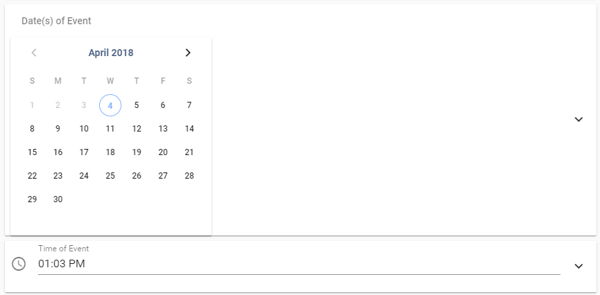

# Retirement Party
This is your User Manual, How To For Dummies, Explain It Like I'm Five, How Do I Do This Answer!
Hopefully this will answer all possible questions you may have about this WebApplication.

To get to the WebApp:
http://cmpt371g4.usask.ca:9010/

# ChromeBit vs. Everything Else
This WebApp can be access via a mobile device (such as a cell phone, tablet), a computer, or a ChromeBit. A ChromeBit is essentially a small computer, however, for this document we will make a clear distinction between them as they both have different use cases.

When opening the WebApp on a computer/mobile device the default page you will be directed to is the Slides page. Whereas, with the ChromeBit it will be set to only view the Show View page. <i>What are these pages?! Have no fear, we will get there!</i>

Explains:
* <s>The differences between these views</s>
* How to set up the ChromeBit
    * So it can load on the Show View Page on boot
    * Updating the ChromeBit
## ChromeBit
As previously stated, the default page for the ChromeBit is the Show View page.
This page will flip/rotate/carousel through all of the events that you have saved in the system to display to your residents.
Each slide will be shown for 20 seconds by default, unless set to a different interval, before moving to the next slide in the queue.

--ADD PHOTO OF CHROMEBIT DISPLAY HERE--

## Mobile
Reminder, a mobile device in this document (for this system) is any device that is not a ChromeBit.
### Show View Page
### Designer Page
Just one place you can go to create a new slide to be saved into your Slides list! Where each slide is it's own event.

#### *You Mean There Are Other Places A New Slide Can Be Added?*

Yes! Another location you can go to create a new Slide is the Slides Page. Look at the bottom right corner, you should see a plus sign.
Clicking this button takes you right back here, the Designer Page!

#### *What does the content of the page look like?*

#### Adding a New Slide
To add a new slide, as you may have noticed there are three required fields that must be filled in order to make a Slide.
* Title of Event

* Description of Event

* Photos (although this field does not have an asterisk it is a required field)

##### Setting a Time and Date
There is no default date, and if no date is selected then it is assumed that the Slide is a general announcement for the current day and the time is defaulted to the time you opened the page.

To set a date date, select a day on the calendar.
And to change the default time, click on the time and a clock will pop up:

Select your new time and voila! To differentiate between AM and PM, click which option you want.

##### Adding/Removing Photos on Slides
Adding a photo to this application is much like any other application. 
Click the plus button and find the photo you wish to show!
Removing them is just as easy! Click the red 'X'.

##### *I'm Finished Editing a Slide, Now What?*
From this point on you can do a couple of things, click:
* Clear, this option will clear your entire page

* Preview, see what this does below

* Submit, this option will bring you to the Preview page so you can see your slide. From here you will need to click submit again to make your Slide to be added to the Show View Page.

###### Preview
The Preview button will open up a preview so you can see what your Slide will look like when it is submitted.

##### Customizing Different Fields
Each field can be customized, just click the down arrow.

And once everything is set, it can look.... Cool?

Okay, lets face it... I'm not good at designing things.

##### Slide Settings
There is also another thing that you may have noticed, it's the Slide Settings configuration. 
Again, if you click the down arrow it will pop up with a new area.

From here you can customize a few things:
* Duration, the amount of 'air time' you wish for it to have on the Show View Page!
The options range from 10seconds to 80seconds, in 10second intervals.

* Wait, another Duration?

* Days on Display, this is where you can set if this is repeating and when.

### Slides Page
### Calendar Page
### Food Menu Widget
This is where you can display all of the food items you will be providing at Sherbrooke Community Centre on a weekly basis.
#### Adding and Removing Weeks
This widget allows you to add up to 5 weekly meal schedules and requires a minimum of one weeks menu.
If you try to add more then five weeks then you should expect to see the following error message appear:

Likewise, if you try to remove too many weeks you will also see an error message:

But wait! *How can I add a new week? How can I remove a week? What does this page even look like?*
Well, the page looks as follows:

That example would be what you would see if this is the first time ever using the system, or you've added a new week.
(Adding a new week will create empty fields for all days where you must manually input the items on the menu.)
Now to adding a week, see the red and white plus sign at the top right corner?

Click that, and bam! You have got yourself a new week.

#### Adding Food Items

One can only add 5 items per meal and entering the food item is easy! Just type the item into the text field.

Similarly, to remove food, erase it from the text field.

**Important**, once you've customized the week(s) to reflect what items are on the menu, please *please* save it. If you don't then all of your work will be erased.
To save it, click the floppy icon.

So you may have noticed that there was a button that resembled a calendar? 

Clicking this button allows you to pick when the week you're currently editing will show on the displays. 

